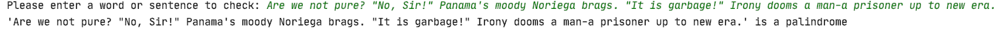

# Palindrome_Project

This is a fun Python (console-based) program to find out whether a word or sentence is a Palindrome.

## Installation: 

Download or clone the repository on your local machine.

```sh
$ git clone https://github.com/AAdewunmi/Palindrome_Project.git
$ cd Palindrome_Project.git
```

## Sample data (Word / Sentence Palindrome)

* https://en.wiktionary.org/wiki/Appendix:English_palindromes
* https://www2.cs.arizona.edu/icon/oddsends/palinsen.htm

## Console display : 




